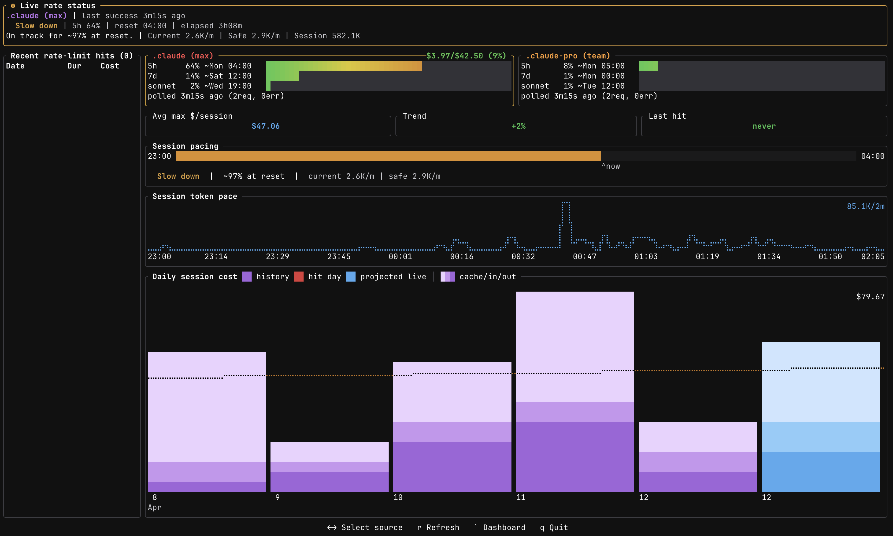

<p align="center">
  
</p>

<p align="center">
  <strong>A terminal dashboard for Claude Code usage analytics</strong><br/>
  Track tokens, costs, code generation, and efficiency, all from your terminal.
</p>

<p align="center">
  
  
  
</p>

---

<p align="center">
  
</p>

## Quick start

```bash
curl --proto '=https' --tlsv1.2 -LsSf https://github.com/hmenzagh/CCMeter/releases/latest/download/ccmeter-installer.sh | sh
ccmeter          # launch the dashboard
# press `.` for the settings panel, `q` to quit
```

## Overview

CCMeter reads your local Claude Code session data and renders an interactive TUI dashboard. Data refreshes every 5 minutes (manual reload with `r`).

**Metrics & analytics**
- **Cost tracking** — per-model USD breakdown (Opus, Sonnet, Haiku) via built-in pricing tables
- **Token analytics** — input, output, and prompt cache usage over time
- **Code metrics** — lines suggested, accepted, added, and deleted, with acceptance rate
- **Active time estimation** — approximates how long you actually spent working on each project from session activity
- **Efficiency score** — tokens per line of code changed (tok/ln, lower is better); each card has a quartile gauge (green → yellow → red) comparing it to other projects
- **KPI banner** — total cost, current streak, active days, avg tokens/day, and efficiency score at a glance

**Visualizations**
- **Heatmaps** — four GitHub-style contribution grids (input, output, lines changed, acceptance rate) with trend sparklines; minute-level granularity on 1h / 12h / Today filters
- **Project cards** — scrollable grid with per-project sparklines colored by model usage
- **Per-project detail** — dedicated charts, model distribution, cost sparklines, and estimated active time
- **Time filters** — 1h, 12h, Today, Last week, Last month, All

**Rate limit tracking** (press `` ` `` to toggle)
- **Live usage monitor** — polls `/api/oauth/usage` for each Claude OAuth account and shows 5h, 7d, Opus, Sonnet, and Cowork window utilization in real time
- **Credential cards** — one per source root with subscription tier, expiry, and current usage bars
- **Session forecast** — extrapolates when you'll hit each rate limit window based on current token velocity
- **Session chart & timeline** — historical rate-limit hits per source, plus minute-level token usage over the active window
- **Overage tracking** — surfaces `extra_usage` credits and monthly limits when enabled

**Project handling & performance**
- **Auto-discovery & grouping** — finds Claude projects and groups them by git repository
- **Multi-source roots** — switch between Claude config directories with `Shift+Tab`
- **Persistent cache** — historical metrics cached locally for near-instant startup; only new sessions get parsed
- **Responsive layout** — heatmaps and card grids adapt to terminal size

## Installation

### Install script (recommended)

```bash
curl --proto '=https' --tlsv1.2 -LsSf https://github.com/hmenzagh/CCMeter/releases/latest/download/ccmeter-installer.sh | sh
```

### Homebrew

Install prebuilt binaries via Homebrew:

```bash
brew install hmenzagh/tap/ccmeter
```

### From source

```bash
git clone https://github.com/hmenzagh/CCMeter.git
cd CCMeter
cargo install --path .     # installs `ccmeter` to ~/.cargo/bin (make sure it's in $PATH)
```

Or build without installing — the binary will be at `target/release/ccmeter`:

```bash
cargo build --release
```

**Requirements (from source):** Rust 1.85+ and Cargo.

## Usage

```bash
ccmeter
```

### Keybindings

| Key | Action |
|-----|--------|
| `Tab` | Cycle time filter |
| `Shift+Tab` | Switch source root |
| `` ` `` | Toggle rate limit tracking view |
| `j` / `k` or `Up` / `Down` | Scroll projects |
| `h` / `l` or `Left` / `Right` | Navigate between projects (or credentials in rate tracking) |
| `Esc` | Deselect project |
| `.` | Open settings panel |
| `r` | Reload data |
| `q` / `Ctrl+C` | Quit |

### Settings panel

Press `.` to open the settings panel, where you can:

- **Rename** projects with custom display names
- **Merge** multiple projects into a single group
- **Split** sources out of auto-detected groups
- **Star** favorites (animated rainbow border)
- **Hide** projects from the dashboard

## How it works

CCMeter discovers Claude Code sessions by scanning your home directory for any folder whose name contains `claude` and that has a `projects/` subdirectory with session logs (so `~/.claude/projects`, `~/.config/claude/projects`, and other Claude-compatible CLIs are all picked up automatically). It parses JSONL session files in parallel using [rayon](https://github.com/rayon-rs/rayon), extracts token counts and model identifiers, and computes costs from built-in pricing tables.

```
Session JSONL → parallel parse → daily aggregates → cached history → TUI render
```

### Accurate token counting

Claude Code logs the same API response in several places — once per streaming chunk, again in every sub-agent's transcript, again in any `/compact` retry. Summing every line naïvely inflates tokens by 2–3× on busy days.

CCMeter dedupes by `requestId` (Anthropic's billing unit: one request = one invoice line). For each request it picks the most complete log, then re-emits it as per-chunk deltas so multi-minute streams keep their real timestamps. Activity from non-canonical mirror logs survives as zero-billing "ghost" markers, so `active_minutes` and code metrics stay accurate even when the canonical log is just a terminal snapshot. User-side patches (Edit/Write acceptances) are deduped by line `uuid` for the same reason.

Result: totals match what Anthropic actually billed, and the minute-level timeline reflects real activity.

### Cache

Parsed metrics are persisted to `~/.config/ccmeter/history.json` so subsequent launches only re-parse new or modified session files.

The cache is versioned. When CCMeter ships a change that would make pre-existing aggregates wrong (e.g. the dedup work above), the schema is bumped and any older cache is rebuilt from scratch on next launch — a one-time banner explains why historical totals may have shifted. A second banner appears if the cache was unreadable (corruption, disk error). Both dismiss on any keypress.

**Upgrading from before the dedup fix?** Expect your historical numbers to drop on days with heavy sub-agent or `/compact` activity. That's the over-counting going away, not data loss.

### Per-project view

Use `h`/`l` or arrow keys to select a project card. The dashboard switches to a detail view showing:

- Cost and token charts scoped to that project (daily or minute-level depending on time filter)
- Model distribution bar with per-model cost breakdown
- Active time estimate, sessions count, lines added/deleted, and efficiency gauge
- Heatmaps filtered to the selected project only

Press `Esc` to go back to the global overview.

<p align="center">
  
</p>

### Rate limit tracking

Press `` ` `` (backtick) to switch to the rate limit tracking view. CCMeter reads your Claude OAuth credentials and polls `/api/oauth/usage` at randomized intervals (5–10 min per account) to show real-time utilization of each rate limit window.

- **Credential cards** — one per source root, with subscription tier, token expiry, and usage bars for the 5h, 7d, Opus, Sonnet, and Cowork windows
- **Live summary & KPI bar** — currently selected account's status at a glance
- **Session forecast** — projects when you'll hit each limit based on recent token velocity
- **Usage timeline & session chart** — minute-level token usage for the active 5h window and historical rate-limit hits per source
- **Overages** — surfaces `extra_usage` credits and monthly limits when enabled on your plan

Navigate between accounts with `←` / `→` (or `h` / `l`), refresh with `r`, and press `` ` `` again to return to the main dashboard.

CCMeter only sees tokens from Claude Code sessions (local JSONL logs). Tokens consumed through the Claude chat (claude.ai web/desktop) count against the same rate limits but are not visible to CCMeter, so forecasts and utilization bars may under-report actual usage when you also chat with Claude alongside coding. Rate limit history is persisted locally at `~/.config/ccmeter/rate-history.json` and `~/.config/ccmeter/usage-hit-history.json` so session charts and hit timelines survive restarts — delete these files to reset the tracking history.

<p align="center">
  
</p>

## Configuration

User overrides are stored at `~/.config/ccmeter/overrides.json` and can be edited through the settings panel or manually.

## Tech stack

| Crate | Role |
|-------|------|
| [ratatui](https://ratatui.rs) | Terminal UI framework |
| [crossterm](https://github.com/crossterm-rs/crossterm) | Terminal event handling |
| [clap](https://github.com/clap-rs/clap) | CLI argument parsing |
| [rayon](https://github.com/rayon-rs/rayon) | Parallel JSONL parsing |
| [chrono](https://github.com/chronotope/chrono) | Date/time handling |
| [serde](https://serde.rs) / [serde_json](https://github.com/serde-rs/json) | Serialization & JSONL parsing |
| [dirs](https://github.com/dirs-dev/dirs-rs) | Cross-platform home/config paths |

## Project structure

```
src/
├── main.rs               # Entry point & event loop
├── app.rs                # Core application state & view routing
├── update_check.rs       # GitHub release version check
├── config/
│   ├── discovery.rs      # Project auto-discovery
│   ├── overrides.rs      # User configuration & merges
│   └── settings.rs       # Persistent user preferences
├── data/
│   ├── parser.rs         # JSONL session parsing
│   ├── cache.rs          # Persistent metric cache
│   ├── index.rs          # Compact event index
│   ├── tokens.rs         # Daily token aggregation
│   ├── models.rs         # Model pricing tables
│   ├── oauth.rs          # OAuth credential loading & async usage polling
│   ├── rate_limits.rs    # Rate-limit hit parsing
│   ├── rate_history.rs   # Persisted rate-limit history
│   └── hit_history.rs    # Historical hit aggregation
└── ui/
    ├── dashboard.rs      # Main layout
    ├── heatmap.rs        # Heatmap rendering
    ├── loading.rs        # Startup loading screen
    ├── theme.rs          # Color theme
    ├── time_filter.rs    # Time range logic
    ├── settings_view.rs  # Settings panel
    ├── cards/            # Per-project cards
    └── rate_tracking/    # Rate limit tracking view (13 modules)
```

## License

MIT
